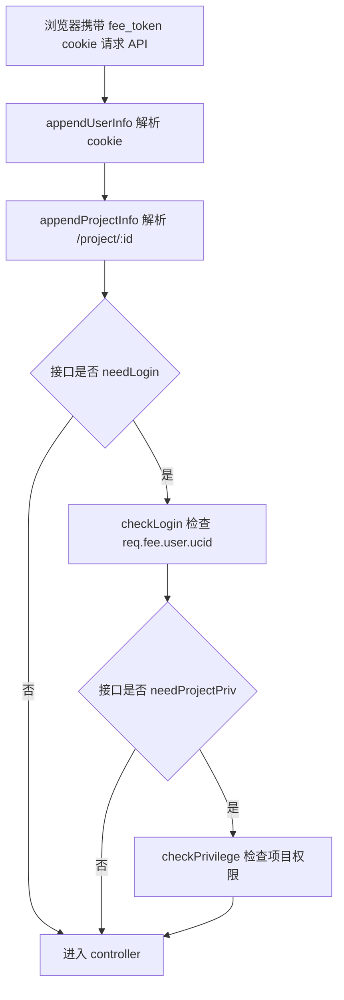

# 用户管理模块设计与现状评估

> 阅读范围：`server/src/routes/api/login`、`server/src/routes/api/user`、`server/src/routes/api/project`、`server/src/middlewares/privilege.js`、`server/src/library/auth`、`server/src/model/project/user.js`、`server/src/model/project/project_member.js`、`client/src/router`、`client/src/store`、`client/src/api/user.js`、`client/src/api/member`、`client/src/view/login`、`client/src/view/main`、`client/src/view/management` 等。
>
> 结论基于当前仓库源码，不代表生产环境实际部署中是否有额外网关、Nginx、UC 系统或数据库初始化脚本补充逻辑。

## 一、结论先行

当前项目有一套可识别的用户管理设计，核心是：

- `t_o_user` 保存管理后台用户身份。
- `t_o_project_member` 保存用户与项目的关系，并承担项目访问权限与项目内角色。
- 登录成功后服务端写入 `fee_token` cookie。
- 后端中间件从 cookie 解析用户信息，按接口配置做登录校验和项目权限校验。
- 前端用 cookie 判断是否登录，用 Vuex `access` 控制菜单展示，用路由 `meta.access` 表达页面权限意图。

但这套体系并不完整，当前更接近“内部系统可用的基础登录 + 项目成员粗粒度权限”，还不是一套严谨完整的用户管理/RBAC 系统。普通注册、普通登录、退出、个人信息修改、改密等主流程具备实现；项目成员管理也有 owner/admin 校验。但前端页面权限没有真正闭环，部分接口权限过宽，账号注销链路有明显 bug，token 和密码安全设计也偏弱。

需要特别区分两类“用户”：

- 管理后台用户：登录 `client` 后台的人，存在 `t_o_user`，本文主要讨论这一类。
- SDK 上报中的业务用户/访客：埋点数据里的 `uid`、`uuid`、新增用户统计等，属于监控数据维度，不等同于后台账号。

## 二、相关模块与职责

### 1. 服务端核心文件

| 文件 | 职责 |
| --- | --- |
| `server/src/routes/api/login/index.js` | 登录、退出、登录类型接口；支持普通登录和 UC 登录。 |
| `server/src/routes/api/user/index.js` | 用户详情、注册、搜索、修改信息、改密、注销等接口。 |
| `server/src/model/project/user.js` | `t_o_user` 数据访问层，包含注册、查询、密码 hash、管理员判断等。 |
| `server/src/model/project/project_member.js` | `t_o_project_member` 数据访问层，包含项目成员、项目权限、owner 判断、报警接收人等。 |
| `server/src/routes/api/project/member/index.js` | 项目成员列表、添加、删除、修改角色、报警开关。 |
| `server/src/routes/api/project/item/index.js` | 项目列表、项目增删改查；项目列表会返回当前用户在项目中的角色。 |
| `server/src/middlewares/privilege.js` | 从 cookie 解析用户和项目 ID，执行登录校验与项目权限校验。 |
| `server/src/routes/index.js` | 根据 `routerConfigBuilder` 的 `needLogin`、`needProjectPriv` 注册不同权限级别的路由。 |
| `server/src/library/auth/index.js` | 生成和解析 `fee_token`。 |
| `server/src/configs/common.js` | `loginType` 配置，当前开发环境为 `normal`。 |
| `server/src/configs/project.js` | `OPEN_PROJECT_ID_LIST` 开放项目配置，当前项目 `1` 对所有登录用户开放。 |

### 2. 前端核心文件

| 文件 | 职责 |
| --- | --- |
| `client/src/view/login/login.vue` | 登录/注册页容器，负责登录成功跳转和注册后切回登录。 |
| `client/src/components/login-form/login-form.vue` | 登录表单，当前页面只放开普通登录选项。 |
| `client/src/components/register-form/register-form.vue` | 注册表单。 |
| `client/src/api/user.js` | 登录、注册、用户详情、改密、改昵称、注销等接口封装。 |
| `client/src/store/module/user.js` | 保存 token、用户权限 `access` 等状态；保留了一部分 iview-admin 模板逻辑。 |
| `client/src/router/index.js` | 全局路由守卫，按 cookie 判断登录态，尝试做页面权限判断。 |
| `client/src/router/routers.js` | 页面路由与 `meta.access` 配置，成员管理父路由标注 `owner`。 |
| `client/src/view/main/main.vue` | 后台主框架；加载项目列表，并按当前项目角色写入 Vuex `access`。 |
| `client/src/view/main/components/dropdownList/projectList.vue` | 顶部项目切换，下拉项目列表，切换项目时更新 `access`。 |
| `client/src/view/main/components/user/user.vue` | 顶部用户下拉：退出、修改信息、修改密码、注销账号。 |
| `client/src/view/management/index.vue` | 成员管理页面。 |
| `client/src/view/management/components/addUser/index.vue` | 成员管理里的新增用户弹窗。 |
| `client/src/api/member/index.js` | 项目成员接口封装。 |

## 三、数据模型设计

### 1. `t_o_user`：后台用户表

`t_o_user` 是管理后台账号表，不按项目分表。主要字段含义：

| 字段 | 含义 |
| --- | --- |
| `ucid` | 用户唯一标识。站点注册时由 account 派生；UC 登录时来自 UC 系统。 |
| `account` | 登录账号，通常是邮箱或 UC 账号。 |
| `email` | 邮箱。 |
| `password_md5` | 密码 hash。当前实现是三重 MD5 加固定 salt。 |
| `nickname` | 昵称。 |
| `role` | 全局角色，当前模型中主要是 `dev` / `admin`。 |
| `register_type` | 注册来源，`site` 表示站点注册，`third` 表示第三方/UC 同步。 |
| `avatar_url` | 头像。 |
| `mobile` | 手机号。 |
| `is_delete` | 软删除标记。 |

重要点：

- `role=admin` 是全局管理员。`MUser.isAdmin(ucid)` 会检查 `t_o_user.role === 'admin'` 且未删除。
- 普通注册用户默认 `role=dev`、`register_type=site`。
- UC 登录同步用户默认 `register_type=third`，没有用户主动输入的本地密码。
- 普通登录接口只查 `register_type=site` 的用户，因此 UC 同步用户不能通过普通密码登录。

### 2. `t_o_project_member`：项目成员与项目权限表

`t_o_project_member` 保存“哪个用户属于哪个项目，以及在项目中的角色”。

| 字段 | 含义 |
| --- | --- |
| `project_id` | 项目 ID，对应 `t_o_project.id`。 |
| `ucid` | 用户 ID，对应 `t_o_user.ucid`。 |
| `role` | 项目内角色，当前主要是 `owner` / `dev`。 |
| `need_alarm` | 是否接收该项目报警。 |
| `is_delete` | 软删除标记。 |
| `create_ucid` / `update_ucid` | 创建人/更新人。 |

重要点：

- `role=owner` 是项目维度的负责人/组长。
- `role=dev` 是普通项目成员。
- 全局 `admin` 不需要出现在项目成员表中，也能访问所有项目。
- `server/src/configs/project.js` 中 `OPEN_PROJECT_ID_LIST = [1]`，表示项目 `1` 是开放项目，所有登录用户都有项目权限。
- `MProjectMember.hasPrivilege(projectId, ucid)` 是后端项目权限的核心判断：开放项目直接通过；全局 admin 直接通过；否则检查项目成员表是否有未删除记录。

### 3. `t_o_project` 与用户模块的关系

`t_o_project` 保存项目本身，字段 `id` 是客户端页面 URL 里的项目 ID，也是 SDK 上报 `pid` 对应的项目维度。后台用户能否访问某个项目，不由 `t_o_project` 单独决定，而是由：

```text
t_o_user.role === admin
或 t_o_project_member(project_id, ucid, is_delete=0)
或 project_id 在 OPEN_PROJECT_ID_LIST
```

共同决定。

## 四、服务端认证与授权流程

### 1. 全局请求预处理

`server/src/app.js` 会给 API 请求挂上两个全局中间件：

```text
PrivilegeChecker.appendUserInfo
PrivilegeChecker.appendProjectInfo
```

它们只负责“解析并写入 req.fee”，不直接拦截请求。

- `appendUserInfo`：读取 cookie 中的 `fee_token`，调用 `Auth.parseToken()`，把结果写入 `req.fee.user`。
- `appendProjectInfo`：如果请求路径以 `/project` 开头，就从路径中解析项目 ID，写入 `req.fee.project.projectId`。

例如：

```text
/project/2/api/project/member/list
```

会解析出：

```js
req.fee.project.projectId = 2
```

### 2. 路由注册时决定权限级别

服务端所有 API 会通过 `routerConfigBuilder()` 包装。它的参数是：

```js
routerConfigBuilder(url, methodType, func, needProjectPriv = true, needLogin = true)
```

默认值很重要：

- 默认需要登录。
- 默认需要项目权限。

`server/src/routes/index.js` 会根据这两个字段把接口分到不同 router：

| 配置 | 实际效果 |
| --- | --- |
| `needLogin=false` | 不需要登录，例如注册、登录。 |
| `needLogin=true, needProjectPriv=false` | 需要登录，但不校验具体项目，例如用户详情、项目列表。 |
| `needLogin=true, needProjectPriv=true` | 需要登录，也要校验当前项目权限，例如监控看板、成员管理、报警等项目接口。 |

项目接口会挂在：

```text
/project/:id/...
```

普通登录后访问项目接口时，流程如下：



### 3. Token 与 cookie 设计

登录成功后，服务端会写入这些 cookie：

```text
fee_token
ucid
nickname
account
```

其中真正用于服务端认证的是 `fee_token`。`ucid`、`nickname`、`account` 更像前端辅助信息。

`fee_token` 的生成逻辑在 `server/src/library/auth/index.js`：

1. 把 `{ ucid, nickname, account, loginAt }` 序列化为 JSON。
2. 使用固定 salt 生成 checksum。
3. 把 `{ user, checksum }` 再序列化，并 base64。
4. 写入 cookie。

解析时会校验 checksum，校验失败就认为未登录。

需要注意：

- token 本身没有服务端过期校验，只靠 cookie `maxAge`。当前登录 cookie 设为 100 天。
- cookie 设置了 `httpOnly: false`，前端 JS 可以读取，这对 XSS 防护不友好。
- token 没有服务端会话存储，退出登录只是清除浏览器 cookie；如果 token 泄露，服务端没有撤销机制。
- `generateToken()` 存的是 `nickname`，但 `parseToken()` 读取的是 `name`，因此 `req.fee.user.name` 实际可能为空。不过当前核心校验依赖 `ucid/account`，所以不影响登录权限判断。

## 五、注册流程

当前前端注册入口在登录页：

```text
client/src/view/login/login.vue
  -> client/src/components/register-form/register-form.vue
  -> client/src/api/user.js register()
  -> POST /api/user/register
```

服务端注册逻辑在 `server/src/routes/api/user/index.js`：

1. 读取 `account`、`password`、`nickname`。
2. 默认 `email = account`。
3. 默认 `register_type = site`。
4. 默认 `role = dev`。
5. 用 `MUser.hash(password)` 生成 `password_md5`。
6. 查询 `t_o_user` 是否已有该 account。
7. 不存在或已删除时调用 `MUser.register(account, userInfo)`。
8. 返回“注册成功”或“账号已存在”。

注册成功后不会自动登录，而是前端切回登录模式，用户需要再输入账号密码登录。

注册用户的后续项目权限：

- 新注册用户没有自动写入 `t_o_project_member`。
- 因为项目 `1` 在 `OPEN_PROJECT_ID_LIST`，所以新用户至少可以访问项目 `1`。
- 想访问其他项目，需要项目 owner 或全局 admin 在成员管理中添加。

## 六、登录与退出流程

### 1. 普通登录

前端当前实际显示的是普通登录：

```text
client/src/components/login-form/login-form.vue
  -> emit account/password/loginType=normal
client/src/view/login/login.vue
  -> store action handleLogin()
client/src/store/module/user.js
  -> loginNormal()
client/src/api/user.js
  -> POST /api/login/normal
```

服务端 `handleNormalLogin()` 流程：

1. 读取账号密码。
2. 调用 `MUser.getSiteUserByAccount(account)`，只查 `register_type=site` 用户。
3. 用户不存在或已删除，返回“未注册”。
4. 使用 `MUser.hash(password)` 与 `password_md5` 对比。
5. 密码正确则生成 `fee_token`，写入 cookie。
6. 返回 `ucid`、`nickname`、`account`、`avatarUrl`、`registerType`。

登录成功后，前端跳转到：

```text
/project/1/home
```

也就是说当前登录后的默认项目固定为 1，不会自动跳到“用户最后访问的项目”或“用户第一个有权限的项目”。

### 2. UC 登录

代码保留了 UC 登录能力：

```text
POST /api/login/uc
POST /api/login
GET  /api/login/type
```

`server/src/configs/common.js` 中 `loginType` 当前是 `normal`。服务端 `/api/login` 会按该配置选择 UC 或普通登录。

UC 登录流程：

1. 调用 UC `/security/login` 校验账号密码。
2. 拿到 UC uid 后，再调用 UC `/ehr/user/agent` 获取用户资料。
3. 如果本地 `t_o_user` 没有该账号，则调用 `MUser.register()` 同步到本地。
4. 生成本地 `fee_token`。
5. 返回用户信息。

但当前前端登录表单里 UC 单选项被注释，页面只暴露普通登录。`client/src/api/user.js` 仍然保留 `login()` 调 `/api/login/uc`，`store/module/user.js` 也支持按 `loginType === 'uc'` 调用 UC 登录，只是当前 UI 不会发出这个值。

### 3. 站点直登接口

`POST /api/login/site` 存在，但代码里 `user = {}`，会生成字段为空的 token。注释也说明这是预留/测试接口，当前不能作为有效登录入口。

### 4. 退出登录

前端顶部用户下拉点击退出：

```text
client/src/view/main/components/user/user.vue
  -> handleLogOut()
client/src/store/module/user.js
  -> logout()
client/src/api/user.js
  -> GET /api/logout
```

服务端清除：

```text
fee_token
ucid
nickname
account
```

前端随后清空 Vuex 中的 token 和 access，并跳转到登录页。

## 七、用户资料、改密、注销

顶部用户下拉在 `client/src/view/main/components/user/user.vue` 中实现，进入主框架后会调用：

```text
GET /api/user/detail
```

获取当前登录用户信息。

### 1. 用户详情

`/api/user/detail`：

- 需要登录。
- 不需要项目权限。
- 如果 query 没传 `account`，默认使用 token 中的 `req.fee.user.account`。
- 返回 `MUser.formatRecord()` 处理后的用户字段，不返回 `password_md5`。

### 2. 修改昵称

前端“修改信息”调用：

```text
POST /api/user/modify/msg
```

服务端用当前登录用户的 `ucid` 更新自己的 `nickname`。这条链路是“当前用户修改自己”，权限边界相对清楚。

### 3. 修改密码

前端“修改密码”调用：

```text
POST /api/user/modify/password
```

服务端逻辑：

1. 取当前登录用户 `ucid`。
2. 查询 `t_o_user`。
3. 校验旧密码 hash。
4. 更新新密码 hash。

这条链路只允许改自己的密码。页面上只有 `register_type === 'site'` 的用户显示“修改信息/修改密码/注销账号”，UC 用户不会显示这些本地账号操作。

### 4. 注销账号

设计上有：

```text
GET /api/user/destroy
```

目标是软删除当前登录用户并清 cookie。

但当前这条链路存在明显 bug：

- 前端导入的是 `destroyAccount as apiDestroyAccount`，实际调用的是 `apiCancelAccount()`，该变量未定义。
- 服务端 `destroyAccount` 中 `const rawUser = MUser.get(ucid)` 少了 `await`。
- 服务端判断条件也反了：`_.isEmpty(rawUser) === false || rawUser.is_delete === 1` 时返回“用户不存在”，导致正常用户也会被挡住。

因此“注销账号”当前不能认为可正常使用。

## 八、项目成员管理流程

成员管理是本项目用户权限设计的重要组成部分。页面路径是：

```text
/project/:id/userManage/management
```

相关前端：

```text
client/src/view/management/index.vue
client/src/view/management/components/addUser/index.vue
client/src/api/member/index.js
```

相关服务端：

```text
server/src/routes/api/project/member/index.js
server/src/model/project/project_member.js
```

### 1. 成员列表

前端调用：

```text
GET /project/{id}/api/project/member/list
```

服务端：

1. 从 `req.fee.project.projectId` 获取项目 ID。
2. 查 `t_o_project_member` 中该项目未删除成员。
3. 再用成员 `ucid` 批量查 `t_o_user` 的昵称。
4. 合并返回 `id`、`ucid`、`nickname`、`role`、`need_alarm`。

该接口默认需要项目权限，所以非项目成员不能访问非开放项目的成员列表。

### 2. 添加成员

前端新增弹窗先通过：

```text
GET /api/user/search_uc
```

按账号关键字搜索用户。这个接口会优先调用 UC 搜索，失败时返回一个测试用户兜底数据。

添加时调用：

```text
POST /project/{id}/api/project/member/add
```

服务端关键逻辑：

- 只有全局 `admin` 或当前项目 `owner` 可以添加成员。
- 如果传入的 `ucid` 在本地 `t_o_user` 不存在，会尝试从 UC 用户信息接口拉取资料并注册到本地。
- 如果成员已存在且未删除，跳过。
- 如果成员曾被删除，则恢复并更新角色。

需要注意：`MProjectMember.add()` 的可插入字段中把 `need_alarm` 拼成了 `nead_alarm`，因此新增成员时 `need_alarm` 很可能不会正确写入，只能依赖后续 update 修正。

### 3. 删除成员

前端调用：

```text
GET /project/{id}/api/project/member/delete?id={memberRecordId}
```

服务端只做软删除，且只有全局 `admin` 或当前项目 `owner` 可以删除。

### 4. 修改成员

前端支持两类修改：

- 修改角色 `role`。
- 切换报警开关 `need_alarm`。

接口是：

```text
POST /project/{id}/api/project/member/update
```

服务端逻辑：

- 如果请求体包含 `role`，会校验操作者必须是全局 `admin` 或项目 `owner`。
- 如果只改 `need_alarm`，当前代码没有额外 owner/admin 校验，只要用户有项目权限即可。

这意味着普通项目成员虽然看不到成员管理菜单，但如果直接访问页面或调用接口，理论上可以修改成员的报警开关。角色调整、添加、删除会被后端挡住。

## 九、页面权限与功能权限

### 1. 后端权限是主要安全边界

后端有三层权限：

#### 登录权限

由 `checkLogin()` 实现。只要接口 `needLogin=true`，就会检查 `req.fee.user.ucid` 是否存在。

#### 项目权限

由 `checkPrivilege()` 实现。只要接口 `needProjectPriv=true`，就会检查用户是否能访问 URL 中的 `projectId`。

判断规则在 `MProjectMember.hasPrivilege()`：

```text
开放项目 -> 允许
全局 admin -> 允许
t_o_project_member 中有未删除成员记录 -> 允许
其他 -> 拒绝
```

#### 角色权限

部分 controller 内部有额外角色判断：

- 添加项目：只有全局 `admin`。
- 删除项目：只有全局 `admin`。
- 修改项目 `projectName`：只有全局 `admin`。
- 添加成员：全局 `admin` 或项目 `owner`。
- 删除成员：全局 `admin` 或项目 `owner`。
- 修改成员角色：全局 `admin` 或项目 `owner`。

但这种功能权限不是统一 RBAC 中间件，而是散落在具体接口 controller 中。

### 2. 前端菜单权限

前端 Vuex 用户模块有：

```js
state.access = []
```

主框架加载项目列表后，会根据当前项目角色设置：

```text
owner -> ['owner']
dev   -> ['dev']
```

位置：

- `client/src/view/main/main.vue`
- `client/src/view/main/components/dropdownList/projectList.vue`

菜单生成在 `client/src/store/module/app.js`：

```js
menuList: (state, getters, rootState) => getMenuByRouter(routers, rootState.user.access)
```

`client/src/router/routers.js` 中成员管理父路由配置了：

```js
meta: {
  access: ['owner']
}
```

所以正常从侧边栏看，非 owner 用户不应该看到“成员管理”菜单。

### 3. 前端路由权限不完整

全局路由守卫在 `client/src/router/index.js` 中使用：

```js
canTurnTo(to.name, 'user.access', routes)
```

这里传入的是字符串 `'user.access'`，不是 Vuex 中真实的 `store.state.user.access` 数组。并且 `store` import 被注释掉了。

另外，`canTurnTo()` 当前只检查最终匹配到的子路由自身 `meta.access`，不会继承父路由的 `meta.access`。成员管理的 `access: ['owner']` 写在父路由 `/project/:id/userManage` 上，子路由 `Management` 自身没有 `access`，所以直接访问 `Management` 时路由守卫不会真正阻止。

因此当前“页面权限”更准确地说是：

- 菜单层面有 owner/dev 隐藏逻辑。
- 路由跳转层面没有可靠拦截。
- 真正安全边界仍依赖后端接口权限。

### 4. 功能权限是否存在

存在，但比较粗粒度：

- 后端有登录权限。
- 后端有项目访问权限。
- 少量高危操作有 admin/owner 判断。

不存在完整的“功能权限”体系：

- 没有统一的权限点表。
- 没有按钮级权限配置。
- 没有用户-角色-权限三表模型。
- 没有统一中间件处理 `admin/owner/dev` 的动作级权限。
- 前端页面按钮大多直接展示，失败时靠后端返回无权限。

## 十、与用户管理有关的界面

### 1. 登录/注册页

路径：

```text
/login
```

文件：

```text
client/src/view/login/login.vue
client/src/components/login-form/login-form.vue
client/src/components/register-form/register-form.vue
```

功能：

- 普通账号登录。
- 站点账号注册。
- 登录成功跳转项目 1 首页。
- 注册成功后切回登录。

### 2. 顶部用户下拉

文件：

```text
client/src/view/main/components/user/user.vue
```

功能：

- 展示当前用户昵称。
- 退出登录。
- `site` 用户可以修改昵称、修改密码、注销账号。

注意：注销账号当前不可用，原因见前文。

### 3. 顶部项目下拉

文件：

```text
client/src/view/main/components/dropdownList/projectList.vue
```

功能：

- 调用 `/api/project/item/list` 获取当前用户能访问的项目。
- 展示项目名和采样率。
- 切换项目时根据项目角色写入 Vuex `access`。

它不是传统意义的“用户管理页面”，但它是用户权限进入前端菜单系统的关键入口。

### 4. 成员管理页

路径：

```text
/project/:id/userManage/management
```

文件：

```text
client/src/view/management/index.vue
client/src/view/management/components/addUser/index.vue
```

功能：

- 查看项目成员。
- 新增项目成员。
- 删除项目成员。
- 修改项目成员角色。
- 开关成员报警。

这是当前最接近“用户管理后台”的页面，但它实际管理的是“项目成员”，不是全局用户列表。

### 5. 401 页面

路径：

```text
/401
```

文件：

```text
client/src/view/error-page/401.vue
```

理论上用于前端无权限跳转。但因为路由权限实现不完整，当前能触发的场景有限。

### 6. 报警配置页的用户相关字段

报警配置表中有 `owner_ucid`、成员表中有 `need_alarm`，服务端报警逻辑会用成员表筛选接收人。报警配置页本身不是用户管理页，但会显示创建人、更新人、报警负责人等用户 ID 字段。

## 十一、当前是否完整，能否正常使用

### 1. 能正常使用的部分

在数据库、服务端、客户端都正常启动，且表结构存在的前提下，以下流程基本具备可用性：

- 普通用户注册。
- 普通用户登录。
- 登录态 cookie 维持。
- 退出登录。
- 当前用户详情获取。
- `site` 用户修改昵称。
- `site` 用户修改密码。
- 后端按项目成员关系保护项目接口。
- 项目列表按当前用户返回可访问项目。
- owner/admin 添加、删除、修改项目成员角色。

### 2. 依赖外部系统或配置的部分

UC 登录、UC 搜索、通过 UC 同步用户资料依赖 `server/src/configs/user_center.js` 中的外部 UC 地址、appId、appkey。

当前代码中部分 UC 相关接口有测试兜底：

- 用户搜索 `search_uc` 失败时会返回测试用户。
- 添加项目成员时查询 UC 用户失败，也会构造测试用户。

但 UC 登录本身没有这样的成功兜底，仍依赖真实 UC 登录接口。

### 3. 当前不能认为完整可用的部分

以下问题会影响完整性：

- 前端路由权限没有接入真实 `store.state.user.access`。
- 父路由 `meta.access` 不会被 `canTurnTo()` 继承检查。
- 成员管理页面只能算菜单隐藏，不是真正页面拦截。
- `/api/user/update` 和 `/api/user/delete` 能操作任意 `ucid`，但没有 admin 校验。
- 注销账号前后端都有 bug，基本不可用。
- `/api/login/site` 是空用户占位实现，不能使用。
- `store.getUserInfo()` 调用的是模板遗留 `get_info`，当前服务端没有对应真实接口。
- `/api/login/type` 存在但前端未使用。
- 新注册用户没有加入项目成员表，只能依赖开放项目 `1` 进入系统。
- 项目成员 `need_alarm` 新增字段存在拼写 bug，新增时可能无法正确写入。

因此，如果问“这个项目有没有用户管理模块”，答案是有；如果问“是否完整到可以作为正式后台用户权限系统使用”，答案是否，目前需要修补。

## 十二、设计评价与主要问题

### 1. 优点

当前设计的优点：

- 身份表和项目成员表分开，模型方向是合理的。
- 后端按 `needLogin` / `needProjectPriv` 自动注册路由，避免每个接口重复写登录校验。
- 项目权限放在服务端中间件，安全边界没有完全依赖前端。
- 全局 `admin` 与项目 `owner/dev` 分层，符合监控平台常见场景。
- `OPEN_PROJECT_ID_LIST` 能支持模板项目、演示项目这种“所有登录用户可看”的需求。
- 项目列表接口会带回用户在项目中的角色，方便前端菜单按项目变化。

### 2. 主要问题

#### 前端权限不闭环

路由守卫没有真正使用 Vuex `access`，也没有继承父路由权限。菜单隐藏和直接访问不是一回事。当前设计下，非 owner 用户可以直接输入成员管理 URL 进入页面，只是部分后端操作会失败。

#### 功能权限分散

admin/owner 判断散落在 controller 内部，没有统一权限声明。后续新增接口时很容易漏掉权限检查。

#### 部分用户接口权限过宽

`/api/user/update` 和 `/api/user/delete` 需要登录但不要求 admin，也不是只能操作自己。只要知道目标 `ucid` 就可能更新或删除他人用户资料。这是比较严重的权限风险。

#### 账号注销不可用

前端函数名写错，后端异步和判断逻辑也有问题。这个功能当前属于“页面上看得到，但链路不通”。

#### Token 安全性偏弱

`fee_token` 是自制 base64 + checksum，没有服务端会话、没有服务端过期校验、cookie `httpOnly=false`。内部系统可以先运行，但不适合作为高安全要求的认证方案。

#### 密码安全性偏弱

密码使用多次 MD5 加固定 salt。MD5 不适合存储密码，固定 salt 也无法抵抗同库撞库。更合理的是 `bcrypt`、`argon2`、`scrypt` 这类慢 hash。

#### 硬编码与历史模板痕迹较多

例如：

- token salt 硬编码。
- 密码 salt 硬编码。
- 默认密码 `kehaolea`。
- 默认头像外链。
- `get_info` mock/template 接口残留。
- `siteLogin` 空实现。
- `apiDestroyAccount` / `apiCancelAccount` 命名不一致。

这些会增加维护成本，也容易让后续开发误判哪些接口是真的生产能力。

#### 登录模式前后端不一致

服务端有 `loginType` 和 `/api/login/type`，也有统一 `/api/login`，但前端登录表单固定普通登录，UC 单选项被注释。最终表现是“服务端支持多模式，前端没有完整接入配置”。

#### 项目成员报警开关权限偏松

成员管理更新接口只在包含 `role` 时校验 owner/admin，只改 `need_alarm` 时没有额外校验。若这是“成员自己选择是否接收报警”，接口应限制只能改自己；若这是“项目管理动作”，应限制 owner/admin。

## 十三、建议修复优先级

### P0：先修权限与明显 bug

1. 修复前端路由守卫：
   - 引入 store。
   - 使用 `store.state.user.access`。
   - `canTurnTo()` 支持父路由 `meta.access` 继承。
   - 或在进入项目路由前先获取当前项目角色，再做页面判断。

2. 修复账号注销：
   - 前端调用 `apiDestroyAccount()`。
   - 服务端 `await MUser.get(ucid)`。
   - 修正“用户不存在”的判断。

3. 收紧 `/api/user/update`、`/api/user/delete`：
   - 普通用户只能更新自己允许更新的字段。
   - 删除/修改他人资料必须是 admin。
   - 不允许普通用户通过该接口修改 `role`、`register_type`。

4. 明确成员报警开关权限：
   - 如果是 owner 管理成员报警，给 `need_alarm` 更新也加 owner/admin 校验。
   - 如果是用户自助订阅报警，则接口必须限制只能更新当前登录用户自己的成员记录。

### P1：梳理登录体系

1. 前端改为读取 `/api/login/type`，按配置展示普通登录或 UC 登录。
2. 优先使用统一 `POST /api/login`，减少前端硬编码 `/api/login/normal`、`/api/login/uc`。
3. 删除或明确标注 `/api/login/site` 不可用，避免误用。
4. `Auth.parseToken()` 返回 `nickname`，与 `generateToken()` 保持一致。
5. 给 token 增加服务端过期校验，或使用成熟 JWT/session 方案。

### P2：提升安全与可维护性

1. 密码 hash 改为 `bcrypt` 或 `argon2`。
2. salt、cookie 安全参数、默认头像、默认密码移入配置，避免硬编码。
3. cookie 建议设置 `httpOnly`、`sameSite`，生产环境配合 `secure`。
4. 为登录、注册、改密、成员管理补充接口测试。
5. 修复 `MProjectMember.add()` 中 `nead_alarm` 拼写。
6. 修复 `MUser.register()` 中用 `getByAccount(ucid)` 检查 ucid 的问题，应使用 `get(ucid)`。
7. 梳理 mock 和模板遗留接口，例如 `get_info`。

## 十四、总体判断

当前用户管理模块的设计方向是能看出来的：后台用户表负责身份，项目成员表负责项目权限，服务端中间件做登录和项目访问控制，前端菜单按当前项目角色显示不同入口。

但当前实现还没有达到“完整用户管理系统”的程度。它可以支撑内部演示、基础登录和项目成员粗粒度管理；如果用于长期维护或生产环境，建议优先修复路由权限、用户接口越权、注销链路、token/密码安全和登录模式不一致这几类问题。最重要的原则是：前端菜单隐藏只能改善体验，真正的页面与功能权限必须以后端校验为准，并且应该统一、可审计、可测试。
