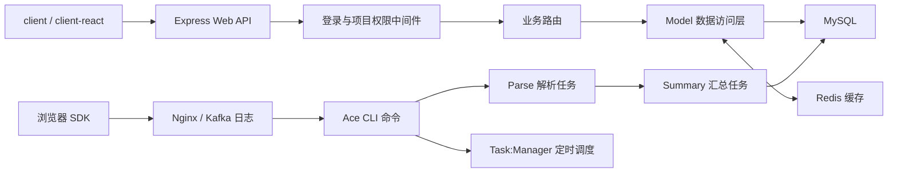

结论：`fee-pro/server` 是一个基于 Node.js + Express 4 的模块化单体后端，同时包含一套独立的日志解析、统计汇总和任务调度系统。

它不是 Koa，也不是 NestJS；也不能算完全“纯 Node HTTP”开发，因为 Web 层明确使用了 Express。项目虽然依赖 `@adonisjs/ace`，但仅把它作为 CLI 命令框架，并不是 AdonisJS Web 应用。

## 1. 整体架构

可以把 Server 理解为两个独立入口：



也就是：

- `app.js`：在线 HTTP/API 服务。
- `fee.js`：离线日志处理、统计汇总、缓存、报警和定时任务。

因此它不是单纯的 CRUD 后端，而是“在线查询 API + 离线数据处理流水线”的组合。

## 2. Web 层使用 Express

依赖中明确使用 Express 4.16.2，见 [server/package.json](D:/mywork/demo/fee-pro/server/package.json:40)。

Web 服务入口是 [server/src/app.js](D:/mywork/demo/fee-pro/server/src/app.js:29)：

```js
const app = express()
```

它负责：

- 使用 `body-parser` 解析表单和 JSON。
- 使用 `cookie-parser` 解析登录 Cookie。
- 使用 `cors` 支持跨域和凭证。
- 挂载登录用户、项目上下文中间件。
- 托管 `server/public` 静态文件。
- 把 `/api/*` 和 `/project/:id/api/*` 交给 API Router。
- 其他路径统一返回 `index.html`，支持前端 History 路由。
- 监听配置中的端口，默认是 `3000`。

相关中间件注册集中在 [app.js](D:/mywork/demo/fee-pro/server/src/app.js:38)。

因此 Web 部分本质上就是一个标准的 Express 应用，只是路由注册方式经过了项目自己的封装。

## 3. 自定义路由架构

它没有直接在各文件中大量写：

```js
router.get(...)
router.post(...)
```

而是先用自定义的 `routerConfigBuilder()` 描述接口：

```js
routerConfigBuilder(
  '/api/uv/count',
  METHOD_TYPE_GET,
  async (req, res) => {
    // 业务处理
  }
)
```

这个封装位于 [router_config_builder.js](D:/mywork/demo/fee-pro/server/src/library/utils/modules/router_config_builder.js:16)，为每个接口保存：

- URL。
- GET 或 POST。
- 具体处理函数。
- 是否需要登录。
- 是否需要项目权限。
- 统一的异步异常捕获和 500 返回。

然后 [server/src/routes/index.js](D:/mywork/demo/fee-pro/server/src/routes/index.js:7) 创建四组 Express Router：

- `withoutLoginRouter`：不需要登录。
- `loginRouter`：登录路由总入口。
- `loginCommonRouter`：需要登录，但不要求项目权限。
- `loginProjectRouter`：需要登录且要求当前项目权限。

项目会遍历所有路由配置，再根据 `needLogin`、`needProjectPriv` 自动注册到对应 Router。

所以它是：

> Express Router + 自定义声明式路由注册器

这种设计有一点类似轻量级框架，但本质上仍然是 Express。

## 4. 登录与项目权限

权限中间件位于 [server/src/middlewares/privilege.js](D:/mywork/demo/fee-pro/server/src/middlewares/privilege.js:43)。

执行过程是：

1. 从 Cookie 中读取 `fee_token`。
2. 解析 Token，把用户信息写入 `req.fee.user`。
3. 从 `/project/:id/...` 提取项目 ID，写入 `req.fee.project.projectId`。
4. `checkLogin` 检查用户是否登录、是否已注销。
5. `checkPrivilege` 查询项目成员表，确认用户能否访问该项目。

这意味着项目 ID 和用户信息不是通过 NestJS 的 Guard、Decorator 或 Request Scope 注入，而是通过传统 Express Middleware 写入 `req`。

## 5. 业务层组织方式

它不是严格的 MVC，也没有 NestJS 那样明确的：

- Controller
- Service
- Module
- Provider
- DTO
- Repository

当前更接近三层结构：

```text
routes/api/     请求参数处理、业务编排、返回响应
model/          数据库查询、分表、统计数据访问
library/        MySQL、Redis、认证、日志、HTTP、报警等基础能力
```

例如 UV 路由会：

1. 从 `req.fee.project.projectId` 获取项目。
2. 读取并校验 `st`、`et`、`filterBy`。
3. 调用 `MUniqueView` 模型。
4. 使用统一 API 格式返回。

所以路由文件实际同时承担了一部分 Controller 和 Service 的职责。复杂逻辑则更多放在 `model`、`commands` 和公共库中。

## 6. 数据库和缓存

### MySQL

MySQL 通过 Knex 查询构建器访问，初始化见 [server/src/library/mysql/index.js](D:/mywork/demo/fee-pro/server/src/library/mysql/index.js:7)：

```js
const Knex = knex({
  client: 'mysql',
  connection: { ... }
})
```

Knex 在这里更像 SQL Query Builder，不是 Sequelize、TypeORM、Prisma 那种完整 ORM。项目没有实体模型、关系映射或迁移类，很多模型直接拼装 Knex 查询。

监控数据还存在按项目、月份分表的设计，例如：

```text
table_projectId
table_projectId_YYYYMM
```

相关公共分表逻辑位于 `server/src/model/parse/common.js`。

### Redis

Redis 使用 `ioredis`，并由项目自行封装连接、自动连接和空闲断开逻辑，见 [server/src/library/redis/index.js](D:/mywork/demo/fee-pro/server/src/library/redis/index.js:13)。

Redis主要用于：

- 统计结果缓存。
- 错误分布缓存。
- 减少高频聚合查询。
- 支持 CLI 命令执行完毕后主动释放连接。

## 7. API 返回协议

接口不是只依靠 HTTP 状态码表达前端行为，而是有统一结构：

```ts
{
  code,
  action,
  data,
  msg,
  url
}
```

定义位于 [server/src/constants/api_res.js](D:/mywork/demo/fee-pro/server/src/constants/api_res.js:18)。

`action` 包含：

- `success`
- `alert`
- `redirect`
- `login`
- `forbitan`

其中 `forbitan` 是历史兼容拼写。

因此旧客户端和新 React 客户端都需要根据 `action` 决定展示消息、跳转登录页或进入 401，而不能只判断 HTTP 200/500。

## 8. CLI 和日志处理系统

另一入口是 [server/src/fee.js](D:/mywork/demo/fee-pro/server/src/fee.js:14)。

它使用：

```js
import ace from '@adonisjs/ace'
```

这里容易产生误解：它只是使用 AdonisJS 的 Ace 命令行组件，没有使用 AdonisJS 的 HTTP Server、IoC 容器、路由或 ORM。

Ace 注册的命令包括：

- `SaveLog:Kafka`
- `SaveLog:Nginx`
- `Parse:UV`
- `Parse:Monitor`
- `Parse:Performance`
- `Summary:UV`
- `Summary:PV`
- `Summary:Error`
- `Summary:SystemOS`
- `WatchDog:Alarm`
- `Task:Manager`
- SQL 生成和日志清理工具

命令由 [fee.js](D:/mywork/demo/fee-pro/server/src/fee.js:62) 注册并执行。

`Task:Manager` 再通过 `node-schedule` 按分钟、小时、天调度这些命令。因此大量监控数据不是用户请求 API 时临时计算的，而是后台任务提前解析、汇总、缓存，API 主要负责读取结果。

## 9. 编译和运行方式

源码使用 ES Module 风格：

```js
import express from 'express'
```

但不是直接运行 `src`，而是先通过 Babel 编译到 `dist`：

```powershell
npm run build
```

开发运行的实际文件是：

```powershell
nodemon dist/app.js
```

CLI 实际运行：

```powershell
node dist/fee.js
```

相关脚本见 [server/package.json](D:/mywork/demo/fee-pro/server/package.json:12)。

所以修改 `server/src` 后必须：

- 重新执行 `npm run build`；或者
- 保持 `npm run watch` 运行。

## 总结

最准确的描述是：

> fee-pro Server 是一个基于 Express 4 的 Node.js 模块化单体应用，采用自定义声明式路由和权限中间件，使用 Knex + MySQL、ioredis，并通过 Adonis Ace 构建独立的日志解析、统计汇总及任务调度流水线。

它的特点不是现代 NestJS 式强约束架构，而是较早期、偏工程化的 Express 项目：

- Web 框架：Express。
- 架构：模块化单体、在线 API 与离线任务双入口。
- 路由：Express Router + 自定义 RouterConfigBuilder。
- 数据层：Knex + MySQL，部分 Redis 缓存。
- CLI：AdonisJS Ace。
- 定时调度：node-schedule。
- 构建：Babel 编译 `src` 到 `dist`。
- 前端托管：Express 静态目录和 SPA History 回退。